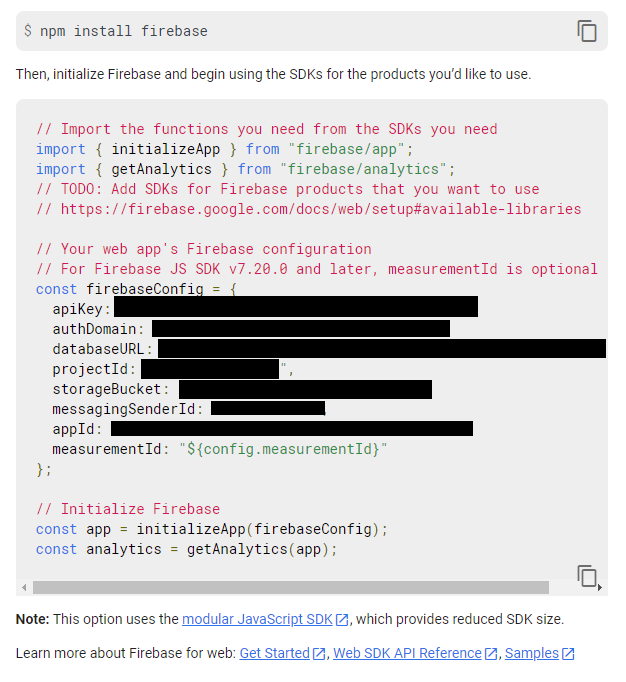

# Project Description
An interactive walking tour map app where users can add and edit points of interest to help travelers find good things to do and see. The app is open to anyone to join, use, and edit. Locals can share points of interest with travelers, or travelers who are learning about a place can share points of interest with other travelers, too. You can look at other peoples’ added points of interest on the map, choose what you want to see, and the app creates a path between the points of interest so you can walk to each one efficiently. The app has a voice guide so you can put in headphones and go from point to point and listen to other people’s descriptions. Each user can add or delete photos and update descriptions.

# Project Documentation
Stored on Google Drive to protect privacy of collaborators. 

# Getting Started


**NOTE:** _Only the Android App is being developed or optimized at this time._

### Develop

Pre-Requisites

- Make sure you have at least node: 16.11.1, yarn: 1.22.15, and expo: 4.12.10
- Have the latest Android Studio and Android Virtual Device (AVD) with Android 29 
	- [Installation Instructions](https://reactnative.dev/docs/environment-setup)

1. Clone the repo
   ```sh
   git clone https://github.com/eknigge/GuideWalker
   ```

2. Install YARN packages 
   ```sh
   yarn install
   ```
3. Start Expo
   ```sh
   expo start
   ```
4. Start Android Studio, select AVD Manager, and launch the emulator
5. On the Expo web UI, select `Run on Android device/emulator` or enter `a` in the command prompt

<!-- ROADMAP -->
# Roadmap

- See the [open issues](https://github.com/eknigge/GuideWalker/issues) for a list of proposed features (and known issues).
- Visit the [Project Board](https://github.com/eknigge/GuideWalker/projects/2) to see current issue progress.


# API Key 
How to get the API key and generate the `.env` file - this file is necessary to connect to cloud services. Without it, it's not possible to load maps or access other data.

1. Navigate to the Firebase project page.
2. In the left navigation pane next to the text *Project Overview*, click on the gear, then click on *Project Settings.*
3. Scroll down and you should see something similar to the following figure.



4. In the main project directory create a `.env` file and copy the relevant elements to the `.env` file. For example, copy the `apiKey: 12345` from Firebase to the `API_KEY = 12345` field in the `.env` file. After you are done the file should look like the following.

```sh
API_KEY= [apiKey]
AUTH_DOMAIN= [authDomain]
PROJECT_ID= [projectId]
STORAGE_BUCKET= [storageBucket]
MESSAGING_SENDER_ID= [messagingSenderId]
APP_ID= [appId]
```

# Database
The project uses the key-value database Firestore to store information and quickly retrieve it. The top-level collection is called `PointsOfInterest`, and represents all points of interest. Each point contains a `Description`, `Location`, `Title`, and `URL` field. The information in each field can be changed, and new fields can be added.

# Acknowledgements

This app was created by [David Nguyen](https://github.com/davidnguyen234), [Eric Knigge](https://github.com/eknigge), [Steven Wang](https://github.com/shipitsteven) and [Tizeta Fantaye](https://github.com/Tizeta2018).